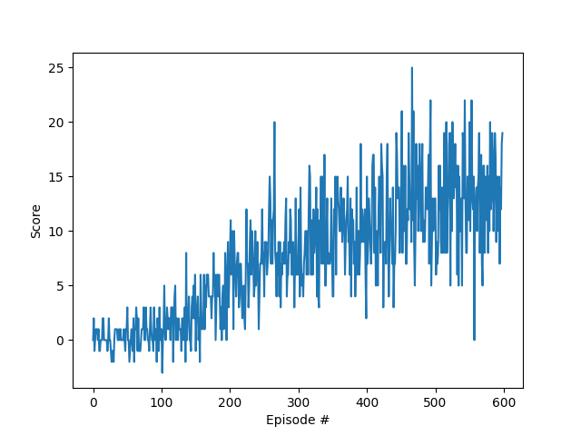

# Project DDQN Banana Navigation
 
### Project Details

This is the first project of the Udacity Deep Reinforcement Learning nanodegree.
For this particular instance, a DDQN is used to solve the Banana Navigation problem from the Unity environment.

The state space has a size of 37, and the action space a size of 4 (front, back, left, right).
Yellow bananas are worth 1 point, and blue ones are worth -1 point.
The environment is considered solved when the average score over 100 consecutive episodes reaches 13.0.

### Getting started

To run this code Python 3.6 is required, along with the dependencies found in [requirements.txt](https://github.com/Matlal033/Project_DDQN_Banana_Navigation/edit/main/requirements.txt)

### Plot of rewards

### Ideas for Future Work

To further improve upon the algorithm used, a few modifications could be easily added, such as :
- Using Prioritized Experience Replay (PER) to give more value to good experiences.
- Implementing a **Dueling DDQN** instead of a simple **DDQN** to make the model converge in less episode by separating the state-value function and the action-advantage function.
