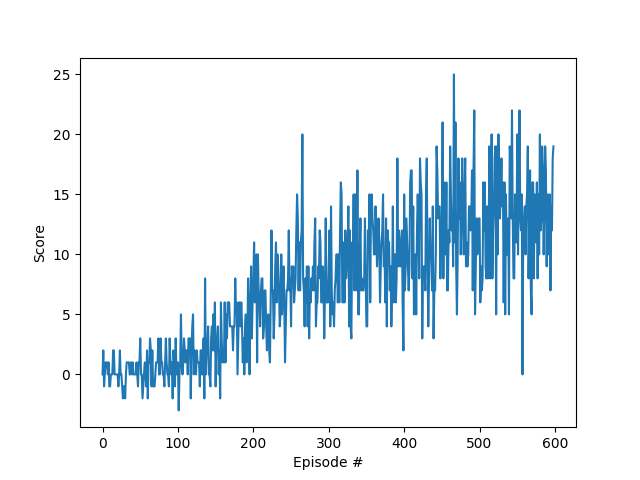
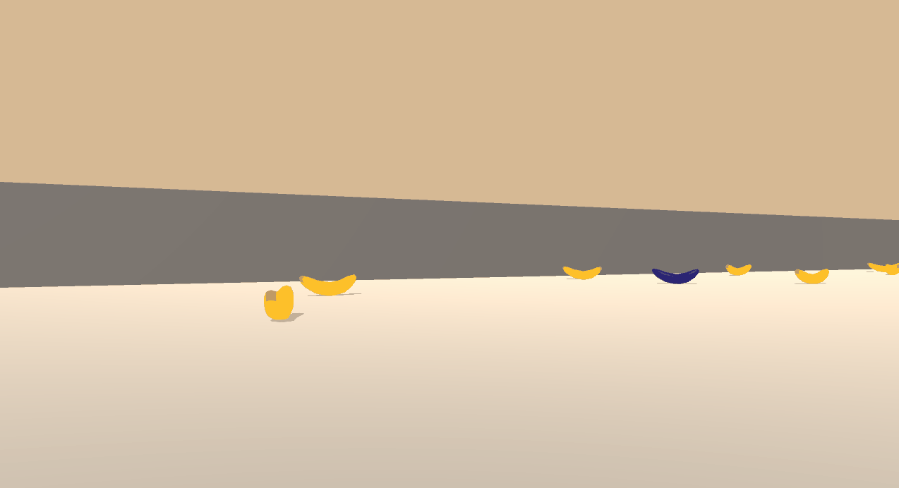
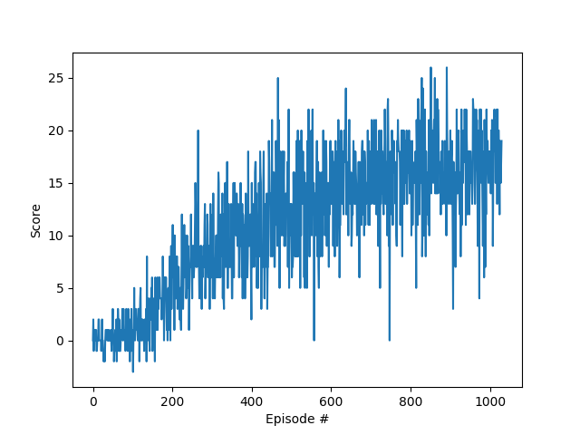

# Project Report

### Learning Algorithm

For this project, the **Double Q-learning (DDQN)** algorithm was used, along with the **Huber Loss** method for the loss function.\
The use of DDQN was to insure a smoother convergence, and the use of Huber loss was to not penalize the local network against a moving target.

The hyperparameters used are :

- *BUFFER_SIZE* = int (2e5)
- *BATCH_SIZE* = 128
- *GAMMA* = 0.98
- *TAU* = 1e-3
- *LR* = 5e-4
- *UPDATE_EVERY* = 5
- *Maximum timesteps per episode* = 1000
- *Epsilon start* = 1.0
- *Epsilon end* = 0.01
- *Epsilon decay rate* = 0.995

The neural network structure is :

| Layer | Type |Input size | Output size | Activation |
|-------|-------|------------|-------------|------------|
| 1 | Fully Connected | 37 (state size) | 64 | ReLU |
| 2 |  Fully Connected | 64 | 64 | ReLU |
| 3 |  Fully Connected | 64 | 4 (action size) | None |

### Plot of rewards

#### Average score of 13

In **499 episodes**, the game was solved by achieving an average reward of at least +13 over 100 episodes.



```
Episode 100     Average Score: 0.37
Episode 200     Average Score: 2.65
Episode 300     Average Score: 7.37
Episode 400     Average Score: 9.43
Episode 500     Average Score: 11.86
Episode 599     Average Score: 13.00
Environment solved in 499 episodes!     Average Score: 13.00
```



#### Average score of 17

In **930 episodes**, an average score of +17 over 100 episodes could be achieved.



```
Episode 100     Average Score: 0.37
Episode 200     Average Score: 2.65
Episode 300     Average Score: 7.37
Episode 400     Average Score: 9.43
Episode 500     Average Score: 11.86
Episode 600     Average Score: 13.00
Episode 700     Average Score: 15.06
Episode 800     Average Score: 15.76
Episode 900     Average Score: 16.36
Episode 1000    Average Score: 16.13
Episode 1030    Average Score: 17.00
Environment solved in 930 episodes!     Average Score: 17.00
```


### Ideas for Future Work

To further improve upon the algorithm used, a few modifications could be easily added, such as :
- Using Prioritized Experience Replay (**PER**) to give more value to good experiences.
- Implementing a **Dueling DDQN** instead of a simple **DDQN** to make the model converge in less episode by separating the state-value function and the action-advantage function.
