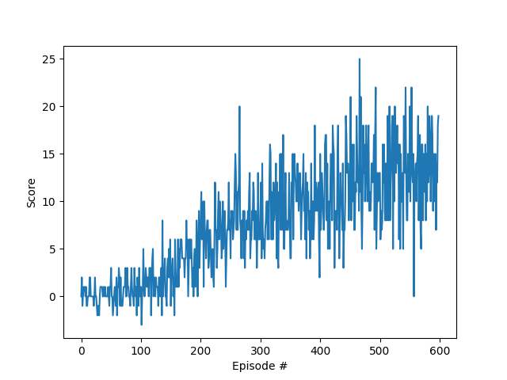

### Learning Algorithm

For this project, the **Double Q-learning (DDQN)** algorithm was used, along with the **Huber Loss** method.

The neural network structure is :
-Fully connected layer (input=37(state_size), output=64) followed by a ReLU activation
-Fully connected layer (input=64, output=64) followed by a ReLU activation
-Fully connected layer (input=64, output=4(action_size)

| Layer | Input size | Output size | Activation |
|-------|------------|-------------|------------|
| 1 | 37 (state size) | 64 | ReLU |
| 2 | 64 | 64 | ReLU |
| 3 | 64 | 37 (state size) | None |

### Plot of rewards

### Ideas for Future Work

To further improve upon the algorithm used, a few modifications could be easily added, such as :
- Using Prioritized Experience Replay (**PER**) to give more value to good experiences.
- Implementing a **Dueling DDQN** instead of a simple **DDQN** to make the model converge in less episode by separating the state-value function and the action-advantage function.
